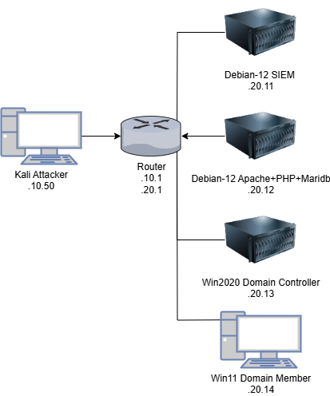

# Ela

## Set up Ludus
Follow how to install ludus, add roles, and deploy ranges
https://docs.ludus.cloud/docs/quick-start/install-ludus

### Required Roles
- ela-attacker
- ela-apache
- ela-beats
- ela-win
- badsectorlabs.ludus_elastic_container

## Login 
### Elastic Stack
https://10.5.20.11:5601/login?next=%2Fapp%2Fhome

```
elastic
S3cur3P@ss?
```

### Attacker 
https://10.5.30.50:8444/

```bash
# vnc creds
kali
password
# user creds
kali
kali
```

### Victim Linux Server
http://10.5.20.12

## Make sure to configure [manual changes](./changes.md) on Windows PCs

## Topology


## Attacker Path
- [Linux](./roles/ela-attacker/files/linux/attacker.md)
- [Windows](./roles/ela-attacker/files/windows/attacker.md)

## Findings 
- [Linux](./images/linux/)
- [Windows](./images/windows/)

### Inspiration
- https://github.com/badsectorlabs/ludus_elastic_container
- https://github.com/olafhartong/sysmon-modular
- https://www.elastic.co/docs
- https://docs.metasploit.com/
- https://www.exploit-db.com/exploits/50406
- https://www.thehacker.recipes/infra/privilege-escalation/unix/living-off-the-land#case-study-1-privesc-using-tar-and-a-cronjob
- https://pentestlab.blog/2019/10/01/persistence-registry-run-keys/
- https://github.com/gentilkiwi/mimikatz/
- https://www.thehacker.recipes/infra/privilege-escalation/windows/weak-service-permissions
- https://github.com/Meckazin/ChromeKatz
- https://github.com/fortra/impacket
- https://github.com/PowerShellMafia/PowerSploit